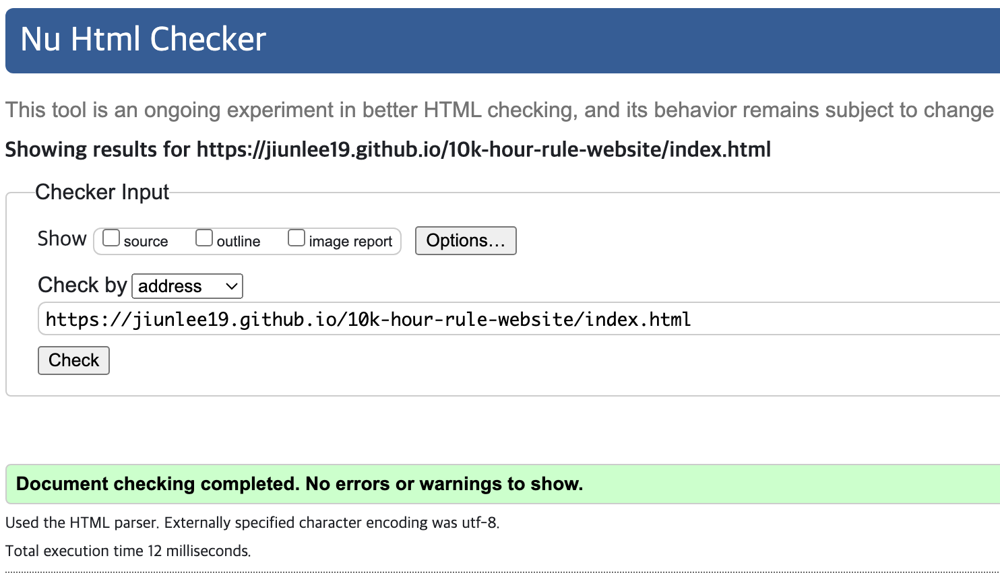
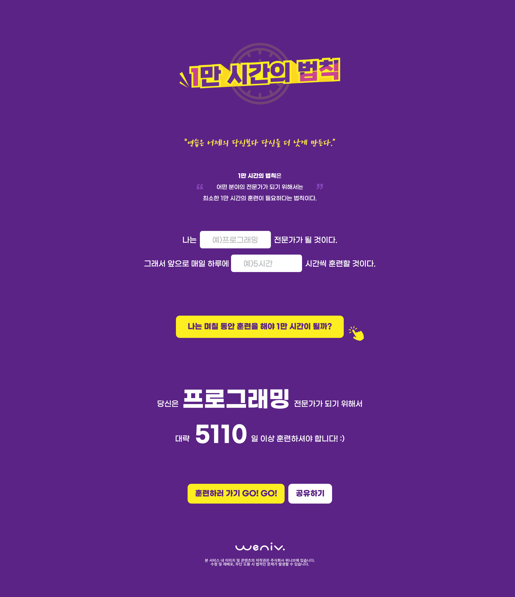
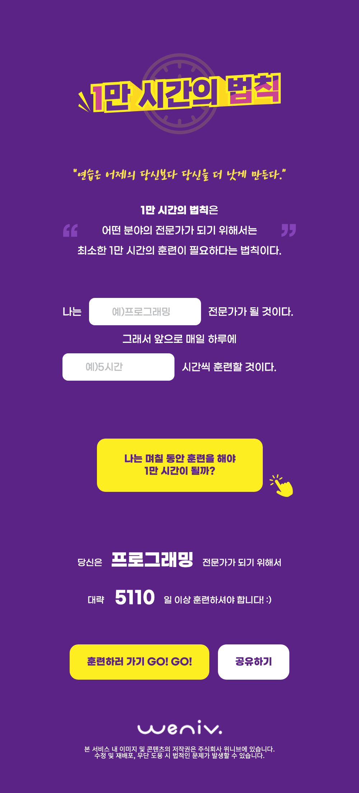

# 1만 시간의 법칙

1만 시간의 법칙 웹사이트 제작  
https://paullab.co.kr/10000hours.html 클론 코딩

### 1. 프로젝트 초기 설정

-   [x] 작업 폴더 구조 생성 (HTML, CSS 등)
    .   
    |-- css    
    |&nbsp;&nbsp;&nbsp;&nbsp;|-- reset.css    
    |&nbsp;&nbsp;&nbsp;&nbsp;|-- index.css     
    |-- img     
    |-- index.html     
    
-   [x] 피그마 파일 검토 및 디자인 요소 다운로드
-   [x] 필요한 이미지, 아이콘, 폰트 등의 자산 추출/준비
-   [x] 기본 HTML 파일 생성
-   [x] 기본 CSS 파일 생성 (Reset CSS 포함)

### 2. 시멘틱 마크업 계획

-   [x] 페이지 구조 분석 및 적절한 시멘틱 태그 선정 (header, nav, main, section, article, footer 등)
        
    ✅ 구조와 시멘틱 태그 사용을 위해 고려한 사항   
    문서 구조화 명확   
    <header>, <main>, <section>, <footer>, <dialog> 등 시멘틱 태그를 활용하여 각 콘텐츠의 역할을 명확하게 분리.   
    
    제목 태그 활용   
    각 section에 <h2> 태그가 들어가 있어 콘텐츠 구간별로 제목이 분리되어 있음.   
    
    의미 있는 콘텐츠 분리   
    ‘소개’, ‘입력 폼’, ‘결과’, ‘모달 응원 메시지’, ‘저작권 정보’ 등 각 영역을 별도의 <section> 또는 <dialog>로 나눠 콘텐츠의 목적과 기능을 명확히 함.   

-   [x] 접근성을 고려한 태그 사용 계획
        
    ✅ 웹 접근성을 위해 고려한 사항   
    스크린 리더 대응을 위한 숨김 제목 제공   
    시각적으로는 보이지 않지만 스크린 리더가 인식할 수 있는 클래스 .sr-only를 활용한 <h2> 제목 사용 (예: “1만 시간의 법칙 소개”, “적용해보기”, “실행 결과” 등).   
    시각 장애 사용자를 위한 내비게이션 구조 제공.   
    
    라벨 제공 (label + for)
    입력창에 label을 제공하고, for 속성과 id 속성으로 연결하여 스크린 리더가 해당 입력 필드의 목적을 정확히 인식할 수 있도록 함.
    텍스트로만 구성된 라벨이 아닌 경우 .sr-only 클래스를 활용하여 시각적으로는 숨기되 의미는 전달되도록 처리함.
    
    이미지에 적절한 alt 속성 사용   
    모든 이미지에 alt 속성을 부여해 이미지의 의미를 전달하거나, 의미 없는 장식용 이미지에는 alt=""로 처리하여 불필요한 정보 전달을 방지.   
    예: 웹사이트 로고, 라이캣 이미지 등은 정확한 설명을 달아 사용자의 이해를 도움.   
    
    버튼과 링크에 시각적+의미적 강조v
    버튼 내부에 <span>으로 텍스트 구간을 나눠 시각적 강조를 주되, 텍스트 정보도 구조적으로 잘 전달됨.   
    시각적 사용자와 비시각적 사용자 모두에게 의미 있는 콘텐츠 전달이 가능.   
    
    대화형 요소 <dialog> 활용   
    모달 콘텐츠에 <dialog> 시멘틱 태그를 사용함으로써, 접근성 도구(스크린 리더 등)가 해당 요소가 대화형임을 정확히 인지 가능.v
            
### 3. 반응형 웹 구현 계획

-   [x] 브레이크포인트 설정 (모바일, 데스크톱)
    - 0-767dp : 모바일
    - 768px~ : 데스크톱 
-   [x] 모바일 퍼스트 vs 데스크톱 퍼스트 접근 방식 결정   
    결정. 모바일 퍼스트   
    이유. 모바일 사용자수가 데스크탑 사용자수를 넘어섰다.    
         <1만시간의법칙> 웹페이지는 다량의 정보제공이나 복잡한 기능을 제공하지 않고,    
         그 내용 또한 빠르게 소비되기에 적합한 소재이기 때문에 모바일 퍼스트 방식으로 개발하기로 결정함.   
-   [x] 이미지 요소의 반응형 처리 방법 계획
    - 픽셀(px) 대신 상대적인 단위(%, em, rem 등)를 사용하여 레이아웃을 구성
    - CSS `width:100%`와 `height:atuo;`사용하여,
    이미지를 포함하는 부모 요소의 너비에 맞춰 이미지가 늘어나도록 설정
    - `<picture>` - `source` 요소를 사용하여 조건에 맞는 이미지를 지정하고, `img` 요소에 기본 이미지를 설정합니다.
        
        ```html
        <picture>
            <source media="(max-width: 767px)" srcset="small-image.jpg">
            <source media="(max-width: 1023px)" srcset="medium-image.jpg">
            
        </picture>
        ```
        
    -  object-fit 속성을 사용하여 이미지 영역에 꽉 차도록 채우거나, 잘리지 않도록 조절할 수 있다.
    -  srcset 속성을 사용하여 브라우저가 네트워크, 메모리, 성능, 시간 등을 고려하여 최적의 이미지를 선택하도록 한다.
        ```html
        
        ```

### 4. 구현 시작

-   [x] HTML 기본 구조 마크업 작성   
-   [x] 기본 스타일 및 레이아웃 CSS 작성   
-   [x] 모바일 버전 스타일링   

### 5. 구현

- [x]  모달창 구현 및 마무리   

### 6. 반응형 구현 시작

- [x]  브레이크포인트 설정 (모바일, 데스크톱)   
- [x]  데스크톱 버전 스타일링 (미디어 쿼리 적용)   
- [x]  이미지 요소의 반응형 처리   

### 7. 접근성 고려

- [x]  적절한 대체 텍스트(alt) 제공   
- [x]  키보드 접근성 확인
- [x]  유효성 검사 확인


### 8. 결과물


